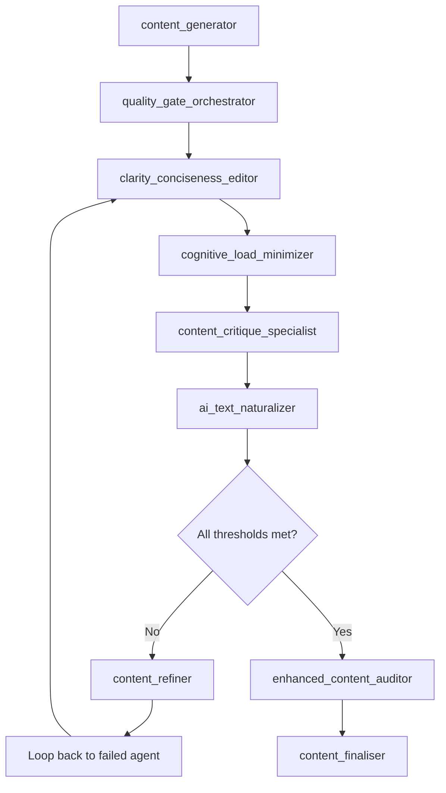
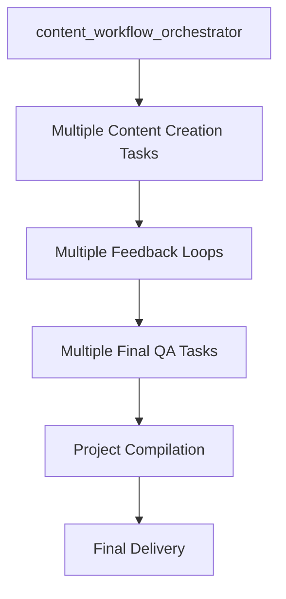

# Orchestrator Roles Clarification

## Agent Hierarchy & Responsibilities

### 1. quality_gate_orchestrator
**Primary Role**: Feedback Loop Management & Quality Control

**Core Responsibilities**:
- **Iteration Management**: Controls feedback loop cycles (max 3 iterations)
- **Agent Sequence Coordination**: Manages flow between the 4 feedback agents
- **Scoring Oversight**: Tracks individual agent scores and thresholds
- **Loop Termination Decisions**: Determines when to proceed, loop back, or escalate
- **Safety Mechanisms**: Prevents infinite loops and manages timeouts
- **Progress Analytics**: Monitors improvement between iterations
- **Refinement Triggers**: Activates content_refiner when scores below threshold

**When to Use**:
```yaml
# Use quality_gate_orchestrator for:
feedback_loop_[content]:
  type: IterativeImprovement
  orchestrator: quality_gate_orchestrator
  agent_sequence: [clarity_conciseness_editor, cognitive_load_minimizer, content_critique_specialist, ai_text_naturalizer]
```

### 2. content_workflow_orchestrator  
**Primary Role**: Overall Project Workflow Management

**Core Responsibilities**:
- **Project-Level Coordination**: Manages entire project workflow from start to finish
- **Task Dependency Management**: Ensures proper sequencing of all project phases
- **Resource Allocation**: Coordinates multiple workstreams and agent assignments
- **Timeline Management**: Tracks overall project progress and deadlines
- **Multi-Content Coordination**: Manages multiple content pieces within a project
- **Stakeholder Communication**: Provides project status updates and reporting
- **Final Assembly**: Compiles all deliverables into final project package

**When to Use**:
```yaml
# Use content_workflow_orchestrator for:
compile_final_delivery:
  type: Finalization
  agent_type: content_workflow_orchestrator
  dependencies: [all_content_feedback_loops_completed]
```

### 3. enhanced_content_auditor
**Primary Role**: Final Multi-Perspective Quality Review

**Core Responsibilities**:
- **4-Perspective Review**: Systematic review across multiple quality dimensions
- **Post-Loop Validation**: Confirms feedback loop improvements were effective
- **Publication Readiness**: Final approval for content release
- **Quality Certification**: Provides quality score and confidence rating
- **Implementation Guidelines**: Adds final implementation notes
- **Compliance Verification**: Final check for brand, legal, and technical compliance

**When to Use**:
```yaml
# Use enhanced_content_auditor for:
final_qa_[content]:
  type: Testing
  agent_type: enhanced_content_auditor
  dependencies: [feedback_loop_[content]]
```

## Workflow Integration

### Standard Content Workflow


### Project-Level Workflow


## Agent Interaction Matrix

### quality_gate_orchestrator Interactions
```yaml
manages_directly:
  - clarity_conciseness_editor
  - cognitive_load_minimizer
  - content_critique_specialist
  - ai_text_naturalizer
  - content_refiner

coordinates_with:
  - content_workflow_orchestrator (progress reporting)
  - enhanced_content_auditor (handoff preparation)

reports_to:
  - content_workflow_orchestrator (when part of larger project)
  - human_oversight (escalation scenarios)
```

### content_workflow_orchestrator Interactions
```yaml
manages_directly:
  - content_generator
  - multiple quality_gate_orchestrators
  - enhanced_content_auditor
  - content_finaliser

coordinates_with:
  - project_stakeholders
  - resource_management_systems
  - timeline_tracking_systems

reports_to:
  - project_director
  - client_stakeholders
```

## Decision Matrix

### When to Use Which Orchestrator

| Scenario | Orchestrator | Reason |
|----------|--------------|---------|
| Single content piece needs improvement | quality_gate_orchestrator | Focused on feedback loop management |
| Multiple content pieces in project | content_workflow_orchestrator | Project-level coordination needed |
| Content failed quality threshold | quality_gate_orchestrator | Handles loop-back and refinement |
| Project timeline management | content_workflow_orchestrator | Overall project responsibility |
| Final project delivery | content_workflow_orchestrator | Compilation and delivery management |
| Feedback loop stagnation | quality_gate_orchestrator | Has escalation mechanisms |

## Implementation Examples

### Single Content Piece
```yaml
# Managed by quality_gate_orchestrator
create_home_page → feedback_loop_home_page → final_qa_home_page
```

### Multi-Content Project  
```yaml
# Managed by content_workflow_orchestrator
project_initiation → 
  ├── create_home_page → feedback_loop_home_page → final_qa_home_page
  ├── create_about_page → feedback_loop_about_page → final_qa_about_page
  └── create_services_page → feedback_loop_services_page → final_qa_services_page
→ compile_final_delivery
```

### Complex Project with Multiple Workstreams
```yaml
# Managed by content_workflow_orchestrator
strategy_phase →
research_phase → 
content_phase →
  ├── Multiple quality_gate_orchestrators (parallel)
  └── Multiple enhanced_content_auditors (parallel)
→ implementation_phase →
final_delivery
```

## Resource Management

### quality_gate_orchestrator Resources
- **CPU**: High during active feedback loops
- **Memory**: Moderate for score tracking and iteration management
- **Time**: Variable based on content complexity (avg 45-90 minutes)
- **Concurrency**: Can manage 1 feedback loop at a time

### content_workflow_orchestrator Resources
- **CPU**: Low to moderate (coordination overhead)
- **Memory**: Low (lightweight task management)
- **Time**: Spans entire project duration
- **Concurrency**: Can coordinate multiple quality_gate_orchestrators

This clarification ensures proper agent selection and prevents role confusion in complex workflows.