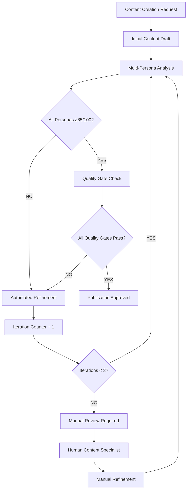

# SOP: Automated Content Refinement System with Multi-Persona Validation

**Version**: 1.0  
**Effective Date**: 03/09/2025  
**Purpose**: Implement automated content audit, refinement, optimization with multi-persona validation  
**Addresses**: User requirement for automated content rewriting until all quality gates passed  

---

## **OVERVIEW & REQUIREMENTS**

### **Current Problem Identified**:
> "I also need the content creation phase to audit, refine, optimise and use the different personas. this should then be fed back and re written automitically until everything is passed. this currently doesn't happen"

### **Solution Framework**:
- **Enhanced multi-persona validation**: 7 comprehensive validation perspectives including Expert, Beginner, Skeptic, Buyer, plus specialized E-E-A-T, Humanization, and Mobile Optimization validators
- **Automated feedback loop**: Continuous refinement until standards met
- **Quality gate enforcement**: No publication until all personas approve
- **British English compliance**: Mandatory throughout all refinement cycles
- **Mobile-first validation**: Ensures content works effectively on mobile devices
- **Maximum iterations**: 3 automatic rewrites before manual intervention

### **Success Criteria**:
- All 4 core personas score content >85/100
- All 3 specialized validation phases score >85/100 (Quality & Clarity >90/100)
- British English compliance: 100% (mandatory)
- Mobile optimization validated
- E-E-A-T signals properly demonstrated
- Natural, human-like language achieved
- Brand voice consistency preserved
- Automated refinement without human intervention

---

## **SECTION 1: MULTI-PERSONA VALIDATION FRAMEWORK**

### **1.1 Persona Definitions & Scoring Criteria**

#### **Enhanced Expert Persona (Industry Professional + E-E-A-T Quality Assessor)**
**Validation Focus**: Technical accuracy, industry credibility, professional terminology, E-E-A-T signals

**Scoring Criteria (0-100)**:
- **Technical Accuracy (25 points)**: Facts, figures, industry standards correct
- **Professional Terminology (20 points)**: Appropriate industry language used correctly  
- **E-E-A-T Signals (25 points)**: Experience, Expertise, Authoritativeness, Trustworthiness demonstrated
- **Evidence Quality (20 points)**: Claims supported with verifiable, authoritative sources
- **Expertise Demonstration (10 points)**: Advanced insights, nuanced understanding

**Pass Threshold**: 85/100

#### **Enhanced Beginner Persona (New to Topic + Cognitive Miser + Task-Driven Problem Solver)**
**Validation Focus**: Clarity, accessibility, jargon-free communication, cognitive load minimization, goal achievement

**Scoring Criteria (0-100)**:
- **Clarity & Simplicity (25 points)**: Complex concepts explained simply
- **Cognitive Load Minimization (25 points)**: Information easy to process, minimal mental effort required
- **Jargon Elimination (20 points)**: Technical terms defined or avoided
- **Goal Achievement Support (20 points)**: Content helps users achieve intended objectives
- **Mobile Clarity (10 points)**: Content remains clear and accessible on mobile devices

**Pass Threshold**: 85/100

#### **Enhanced Skeptic Persona (Critical Reviewer + Devil's Advocate)**
**Validation Focus**: Evidence validation, claim verification, bias detection, argument strengthening

**Scoring Criteria (0-100)**:
- **Evidence Quality (30 points)**: Claims supported with verifiable evidence
- **Critical Analysis (25 points)**: Arguments challenged, counter-arguments considered
- **Bias Detection (20 points)**: Balanced perspective, acknowledged limitations
- **Source Credibility (15 points)**: Reliable, recent, authoritative sources
- **Logical Consistency (10 points)**: Arguments coherent and well-reasoned

**Pass Threshold**: 85/100

#### **Enhanced Buyer Persona (Decision Maker + Task-Driven Problem Solver)**  
**Validation Focus**: Value proposition, benefits focus, action orientation, task completion efficiency

**Scoring Criteria (0-100)**:
- **Value Proposition Clarity (30 points)**: Benefits clearly communicated
- **Action Orientation (25 points)**: Clear next steps and calls-to-action
- **Task Completion Efficiency (20 points)**: User can achieve goals quickly and easily
- **ROI/Benefit Focus (15 points)**: Emphasis on outcomes and results
- **Decision Support (10 points)**: Information supports decision-making process

**Pass Threshold**: 85/100

#### **Specialized Validation Phase 1: Content Quality & Clarity Validator**
**Integration**: Clarity & Conciseness Editor + Humanisation Filter
**Validation Focus**: Grammar, flow, natural language, British English compliance

**Scoring Criteria (0-100)**:
- **British English Compliance (30 points)**: Perfect adherence to British spelling, grammar, and terminology
- **Grammar & Punctuation (25 points)**: Error-free, professional writing standards
- **Natural Language Flow (25 points)**: Eliminates AI-like phrasing, sounds human-written
- **Clarity & Readability (15 points)**: Content flows logically and clearly
- **Conciseness (5 points)**: Information presented without unnecessary verbosity

**Pass Threshold**: 90/100

#### **Specialized Validation Phase 2: SEO Content Optimizer**
**Integration**: SEO Content Optimizer + Keyword Integration
**Validation Focus**: Search engine optimization, keyword integration, meta content

**Scoring Criteria (0-100)**:
- **Keyword Integration (35 points)**: Natural incorporation of target keywords and LSI terms
- **Heading Structure (25 points)**: Clear H1-H6 hierarchy, keyword-relevant headlines
- **Content Structure (20 points)**: Scannable, well-organized for both users and search engines
- **Internal Linking Opportunities (10 points)**: Strategic linking suggestions identified
- **Meta Content Optimization (10 points)**: Title tags and meta descriptions optimized

**Pass Threshold**: 85/100

#### **Specialized Validation Phase 3: Mobile-First User Experience Validator**
**Integration**: Cognitive Miser + Impatient Speedrunner + Design Critic
**Validation Focus**: Mobile usability, speed, visual effectiveness

**Scoring Criteria (0-100)**:
- **Mobile Clarity (30 points)**: Content clear and accessible on mobile devices
- **Task Completion Speed (25 points)**: Users can achieve goals quickly
- **Visual Hierarchy (20 points)**: Information properly prioritized and scannable
- **Friction Elimination (15 points)**: Potential mobile frustrations identified and addressed
- **Attention Management (10 points)**: Content works for distracted, multitasking users

**Pass Threshold**: 85/100

### **1.2 Enhanced Persona Analysis Implementation**

**Agent Requirement**: `content_persona_analyzer` (Currently Missing - Must Be Created)

**Input Requirements**:
```markdown
# Content for Analysis
[Content text]

# Target Audience Definition
- Primary audience: [Description]
- Secondary audience: [Description]
- Industry context: [Context]
- Target keywords: [Primary and LSI keywords]
- Mobile usage context: [Expected mobile usage patterns]

# Success Criteria
- Enhanced Expert persona: Technical accuracy + E-E-A-T for [Industry] professionals
- Enhanced Beginner persona: Accessible + cognitive load minimized for [Experience level] users
- Enhanced Skeptic persona: Evidence standards + critical analysis for [Skepticism level]
- Enhanced Buyer persona: Decision support + task completion for [Purchase context]
- Quality & Clarity: British English + natural language + readability
- SEO Optimization: Keyword integration + content structure for search
- Mobile-First UX: Mobile clarity + speed + visual hierarchy
```

**Output Format**:
```markdown
# Enhanced Multi-Persona Content Analysis Report

## Core Persona Analysis

### Enhanced Expert Persona Analysis
- Score: X/100
- Pass Status: PASS/FAIL
- Technical Accuracy: X/25 | Professional Terminology: X/20 | E-E-A-T Signals: X/25 | Evidence Quality: X/20 | Expertise: X/10
- Key Issues: [List specific problems]
- Improvement Recommendations: [Specific actions needed]

### Enhanced Beginner Persona Analysis  
- Score: X/100
- Pass Status: PASS/FAIL
- Clarity & Simplicity: X/25 | Cognitive Load: X/25 | Jargon Elimination: X/20 | Goal Achievement: X/20 | Mobile Clarity: X/10
- Key Issues: [List specific problems]
- Improvement Recommendations: [Specific actions needed]

### Enhanced Skeptic Persona Analysis
- Score: X/100
- Pass Status: PASS/FAIL
- Evidence Quality: X/30 | Critical Analysis: X/25 | Bias Detection: X/20 | Source Credibility: X/15 | Logical Consistency: X/10
- Key Issues: [List specific problems]
- Improvement Recommendations: [Specific actions needed]

### Enhanced Buyer Persona Analysis
- Score: X/100
- Pass Status: PASS/FAIL  
- Value Proposition: X/30 | Action Orientation: X/25 | Task Efficiency: X/20 | ROI/Benefits: X/15 | Decision Support: X/10
- Key Issues: [List specific problems]
- Improvement Recommendations: [Specific actions needed]

## Specialized Validation Analysis

### Content Quality & Clarity Validator
- Score: X/100 (Threshold: 90/100)
- Pass Status: PASS/FAIL
- British English: X/30 | Grammar: X/25 | Natural Language: X/25 | Clarity: X/15 | Conciseness: X/5
- Key Issues: [List specific problems]
- Improvement Recommendations: [Specific actions needed]

### SEO Content Optimizer
- Score: X/100
- Pass Status: PASS/FAIL
- Keywords: X/35 | Headings: X/25 | Structure: X/20 | Internal Links: X/10 | Meta Content: X/10
- Key Issues: [List specific problems]
- Improvement Recommendations: [Specific actions needed]

### Mobile-First UX Validator
- Score: X/100
- Pass Status: PASS/FAIL
- Mobile Clarity: X/30 | Task Speed: X/25 | Visual Hierarchy: X/20 | Friction Elimination: X/15 | Attention Management: X/10
- Key Issues: [List specific problems]
- Improvement Recommendations: [Specific actions needed]

## Overall Assessment
- Core Personas Average: X/100 (must be ≥85/100)
- Specialized Validators Average: X/100 (must be ≥85/100, Quality & Clarity ≥90/100)
- Overall Composite Score: X/100
- Publication Ready: YES/NO
- Critical Issues: [Blocking issues requiring immediate attention]
- Priority Improvements: [Ranked list of improvements needed]
```

---

## **SECTION 2: AUTOMATED CONTENT REFINEMENT SYSTEM**

### **2.1 Content Auto-Refiner Specification**

**Agent Requirement**: `content_auto_refiner` (Currently Missing - Must Be Created)

**Core Capabilities**:
- Applies specific persona feedback automatically
- Maintains brand voice during refinement
- Preserves content structure and intent
- Tracks improvement iterations

**Refinement Rules**:
1. **Expert Issues**: Add citations, improve technical accuracy, enhance credibility
2. **Beginner Issues**: Simplify language, define jargon, improve logical flow  
3. **Skeptic Issues**: Strengthen evidence, address bias, improve source quality
4. **Buyer Issues**: Clarify benefits, strengthen CTAs, focus on value proposition

**Implementation Process**:
```python
def automated_content_refinement(content, persona_feedback):
    """
    Automatically refines content based on persona analysis feedback
    """
    refined_content = content
    
    for persona, feedback in persona_feedback.items():
        if feedback['score'] < 85:
            if persona == 'expert':
                refined_content = enhance_technical_accuracy(refined_content, feedback)
            elif persona == 'beginner':  
                refined_content = simplify_language(refined_content, feedback)
            elif persona == 'skeptic':
                refined_content = strengthen_evidence(refined_content, feedback)
            elif persona == 'buyer':
                refined_content = enhance_value_proposition(refined_content, feedback)
    
    return refined_content
```

### **2.2 Quality Gate Enforcement System**

**Agent Requirement**: `content_quality_gatekeeper` (Currently Missing - Must Be Created)

**Enhanced Quality Gate Criteria**:
- All 4 core personas score >85/100
- All 3 specialized validators score >85/100
- Content Quality & Clarity Validator score >90/100 (mandatory)
- British English compliance: 100% (mandatory - blocking issue)
- Mobile optimization validated: PASS (mandatory)
- E-E-A-T signals demonstrated: PASS
- Natural language achieved: PASS (no AI-like phrasing)
- Brand voice consistency: >90%
- SEO optimization integrated: PASS
- Readability score: Appropriate for target audience

**Enhanced Enforcement Rules**:
```markdown
# Enhanced Quality Gate Decision Matrix

## PASS Criteria (All Must Be Met)
### Core Personas
- [ ] Enhanced Expert persona: ≥85/100
- [ ] Enhanced Beginner persona: ≥85/100  
- [ ] Enhanced Skeptic persona: ≥85/100
- [ ] Enhanced Buyer persona: ≥85/100

### Specialized Validators (Critical)
- [ ] Content Quality & Clarity Validator: ≥90/100 (BLOCKING)
- [ ] SEO Content Optimizer: ≥85/100
- [ ] Mobile-First UX Validator: ≥85/100 (BLOCKING)

### Mandatory Compliance Checks
- [ ] British English: 100% compliance (BLOCKING)
- [ ] Mobile clarity: PASS (BLOCKING)
- [ ] Natural language (no AI phrasing): PASS (BLOCKING)
- [ ] E-E-A-T signals: Present and credible
- [ ] Brand voice: ≥90% consistency
- [ ] Readability: Target-appropriate

## BLOCKING FAIL Actions (Immediate)
- Block publication immediately
- Flag as CRITICAL FAILURE
- Generate specific improvement requirements with priority ranking
- Trigger automated refinement cycle
- Track iteration count

## STANDARD FAIL Actions
- Block publication
- Generate improvement requirements
- Trigger automated refinement cycle
- Continue iteration tracking

## Manual Intervention Triggers  
- 3 refinement iterations reached without achieving PASS criteria
- Quality scores plateau without improvement (2 iterations)
- Conflicting persona requirements identified
- BLOCKING criteria consistently failing after 2 iterations
- British English compliance issues persist after automated correction
```

### **2.3 Iterative Improvement Workflow**

**Maximum Iterations**: 3 automatic refinements before manual review

**Workflow Process**:


**Enhanced Iteration Tracking**:
```markdown
# Enhanced Refinement Iteration Log

## Iteration 1
### Core Personas
- Enhanced Expert Score: 72/100 → 88/100 ✅
- Enhanced Beginner Score: 68/100 → 84/100 ❌
- Enhanced Skeptic Score: 91/100 → 93/100 ✅
- Enhanced Buyer Score: 76/100 → 89/100 ✅

### Specialized Validators
- Quality & Clarity: 82/100 → 94/100 ✅ (BLOCKING resolved)
- SEO Optimizer: 79/100 → 87/100 ✅
- Mobile-First UX: 73/100 → 83/100 ❌ (BLOCKING)

### Issues Addressed
- British English compliance: Fixed 15 American spellings
- AI phrasing eliminated: Removed robotic transitions
- Mobile clarity improved: Shortened paragraphs, improved headings

### Remaining Problems (Priority)
- BLOCKING: Mobile-First UX still below 85/100
- Enhanced Beginner persona needs cognitive load reduction

## Iteration 2
### Core Personas
- Enhanced Beginner Score: 84/100 → 87/100 ✅

### Specialized Validators  
- Mobile-First UX: 83/100 → 88/100 ✅ (BLOCKING resolved)

### All Personas: PASS
### Enhanced Quality Gates: Checking...
```

---

## **SECTION 3: IMPLEMENTATION SPECIFICATIONS**

### **3.1 Agent Integration Requirements**

**Enhanced Agent Creation Required**:

1. **enhanced_content_persona_analyzer**
   - Tools: WebSearch (for E-E-A-T fact-checking), Read (for context), content analysis libraries, British English validation, mobile readability testing
   - Integration: Works with enhanced_content_auditor, content_strategist, and seo_content_optimizer
   - Core Capabilities: 4 enhanced personas + 3 specialized validators
   - E-E-A-T Assessment: Evaluates Experience, Expertise, Authoritativeness, Trustworthiness signals
   - Humanization Analysis: Identifies AI-like phrasing patterns and robotic language
   - Mobile Analysis: Tests cognitive load and clarity on mobile devices
   - Output: Comprehensive analysis with priority-ranked improvements

2. **enhanced_content_auto_refiner**
   - Tools: Edit, MultiEdit, WebSearch (for additional evidence), British English correction, AI phrasing elimination, mobile optimization
   - Integration: Receives enhanced persona feedback, applies improvements with BLOCKING issue priority
   - Core Capabilities: Addresses 7 validation perspectives systematically
   - Priority Processing: BLOCKING issues (British English, Mobile UX, Quality & Clarity >90) first
   - E-E-A-T Enhancement: Adds credibility signals, authoritative sources, expertise demonstrations
   - Humanization Processing: Eliminates robotic phrasing, improves natural flow
   - Output: Refined content addressing all persona concerns with iteration tracking

3. **enhanced_content_quality_gatekeeper**
   - Tools: Multi-dimensional analysis validation, British English checking, mobile UX testing, E-E-A-T signal verification, AI phrasing detection
   - Integration: Final checkpoint with enhanced quality criteria before publication approval
   - BLOCKING Issue Detection: Immediately flags British English, mobile UX, and quality issues
   - E-E-A-T Validation: Confirms credibility signals are present and appropriate
   - Natural Language Verification: Ensures human-like, conversational tone achieved
   - Output: Enhanced PASS/FAIL decision with critical vs. standard issue categorization

### **3.2 Workflow Integration Points**

**Enhanced Universal Orchestrator Checklist Integration**:

```markdown
## Enhanced Content Creation & Optimization Workflow

### Phase 1: Initial Creation & Enhanced Analysis
- [ ] content_strategist: Create initial content draft with target keywords and mobile considerations
- [ ] enhanced_content_persona_analyzer: 7-perspective validation analysis (4 core + 3 specialized)
- [ ] Priority assessment: Identify BLOCKING vs. standard issues

### Phase 2: Enhanced Automated Refinement Loop (Max 3 iterations)
- [ ] enhanced_content_quality_gatekeeper: Check all enhanced quality gates
- [ ] IF BLOCKING ISSUES: enhanced_content_auto_refiner: Priority refinement (British English, Mobile UX, Quality & Clarity)
- [ ] IF STANDARD ISSUES: enhanced_content_auto_refiner: Apply systematic persona improvements
- [ ] enhanced_content_persona_analyzer: Re-analyze improved content with full validation suite
- [ ] Track iteration with enhanced logging (core + specialized validators)
- [ ] IF iteration > 3 OR plateau detected: Trigger manual review

### Phase 3: Enhanced Publication Approval
- [ ] enhanced_content_quality_gatekeeper: Final comprehensive approval decision
- [ ] Validate: All 4 core personas ≥85/100
- [ ] Validate: All 3 specialized validators ≥85/100 (Quality & Clarity ≥90/100)
- [ ] Validate: British English 100% compliance
- [ ] Validate: Mobile optimization PASS
- [ ] Validate: E-E-A-T signals present
- [ ] Validate: Natural, human-like language achieved
- [ ] IF PASS: enhanced_content_auditor: Final validation
- [ ] Publication approved with enhanced quality assurance
```

### **3.3 Enhanced Error Handling & Edge Cases**

**Conflicting Persona Requirements**:
- Expert wants technical detail, Beginner wants simplification
- **Solution**: Create content sections targeting different audiences, use progressive disclosure
- **Fallback**: Manual content specialist resolution

**Quality Plateau**:
- Scores stop improving after refinements
- **Solution**: Trigger manual review after 2 iterations without improvement
- **Fallback**: Content specialist intervention

**BLOCKING Issues - Critical Priority**:

**British English Compliance Failures**:
- Automated refinement introduces American English spellings/terminology
- **Solution**: British English validation on every refinement iteration with blocking enforcement
- **Emergency Protocol**: Immediate manual language review if compliance <100% after 2 iterations
- **Fallback**: Native British English speaker review

**Mobile UX Validation Failures**:
- Content remains unclear or difficult to use on mobile devices
- **Solution**: Mobile-first refinement with cognitive load testing
- **Emergency Protocol**: Manual UX review if mobile clarity fails consistently
- **Fallback**: Mobile UX specialist intervention

**E-E-A-T Signal Deficiency**:
- Content lacks credibility signals or authoritative backing
- **Solution**: Add expert citations, case studies, authoritative sources, experience indicators
- **Emergency Protocol**: Subject matter expert consultation for credibility enhancement
- **Fallback**: Industry expert review and input

**AI Phrasing Persistence**:
- Humanization filter fails to eliminate robotic language patterns
- **Solution**: Advanced natural language processing with human-like rhythm injection
- **Emergency Protocol**: Human editor review for natural language conversion
- **Fallback**: Professional copywriter refinement

**SEO vs. Readability Conflicts**:
- Keyword integration compromises natural language flow
- **Solution**: Semantic keyword integration with contextual placement
- **Emergency Protocol**: SEO specialist consultation for natural optimization
- **Fallback**: Balance optimization with user experience priority

---

## **SECTION 4: SUCCESS VALIDATION & MONITORING**

### **4.1 Performance Metrics**

**Quality Metrics**:
- Average persona scores across all content
- First-pass approval rate (% content passing without refinement)
- Average refinement iterations required
- Manual intervention frequency

**Efficiency Metrics**:
- Time from content creation to publication approval
- Token usage per refinement cycle
- Automated vs manual refinement success rate

**Enhanced Success Targets**:
- 90% content achieves >85/100 on all 4 core personas
- 90% content achieves >85/100 on all 3 specialized validators (>90/100 for Quality & Clarity)
- 100% British English compliance maintained (BLOCKING requirement)
- 95% mobile optimization validation passed
- 85% natural, human-like language achieved without manual intervention
- 80% E-E-A-T credibility signals properly integrated
- <2.5 average refinement iterations required
- <15% manual intervention rate (accounting for enhanced validation complexity)
- <5% BLOCKING issue escalation rate

### **4.2 Quality Assurance Validation**

**Testing Requirements**:
- Test content refinement with various content types
- Validate persona analysis accuracy
- Confirm quality gate enforcement works
- Verify British English compliance preservation

**Validation Checklist**:
- [ ] All personas consistently rate improved content higher
- [ ] Quality gates block substandard content publication
- [ ] Maximum iteration limits enforced correctly
- [ ] Brand voice maintained through refinement cycles

---

## **IMPLEMENTATION PLAN**

### **Phase 1: Enhanced Agent Development (Week 1-2)**
- [ ] Create enhanced_content_persona_analyzer agent with 7-perspective framework (4 core + 3 specialized)
- [ ] Implement E-E-A-T assessment capabilities with credibility signal detection
- [ ] Develop British English compliance validation with blocking enforcement
- [ ] Build mobile-first UX validation with cognitive load testing
- [ ] Create humanization filter with AI phrasing elimination
- [ ] Develop enhanced_content_auto_refiner with priority-based improvement automation
- [ ] Build enhanced_content_quality_gatekeeper with BLOCKING vs. standard issue categorization

### **Phase 2: Enhanced Workflow Integration (Week 3)**  
- [ ] Update Universal Orchestrator Checklist with enhanced 7-perspective workflow
- [ ] Integrate priority-based automated refinement loop (BLOCKING issues first)
- [ ] Implement enhanced iteration tracking with specialized validator monitoring
- [ ] Test complete enhanced workflow with diverse content samples
- [ ] Validate BLOCKING issue detection and priority processing

### **Phase 3: Comprehensive Validation & Optimization (Week 4)**
- [ ] Validate enhanced persona analysis accuracy across all 7 perspectives
- [ ] Test British English compliance automation and blocking enforcement
- [ ] Validate mobile-first UX improvements and cognitive load reduction
- [ ] Test E-E-A-T signal integration and credibility enhancement
- [ ] Validate humanization filter effectiveness in eliminating AI phrasing
- [ ] Test refinement quality improvements across all validation layers
- [ ] Optimize iteration efficiency with enhanced quality standards

### **Enhanced Success Criteria Validation**
- [ ] Content automatically refined until all 4 core personas >85/100
- [ ] All 3 specialized validators achieve >85/100 (Quality & Clarity >90/100)
- [ ] BLOCKING issues (British English, Mobile UX, Quality & Clarity) prioritized and resolved first
- [ ] British English compliance maintained at 100% throughout process (mandatory)
- [ ] Mobile optimization validated and confirmed for all content
- [ ] E-E-A-T credibility signals properly integrated and verified
- [ ] Natural, human-like language achieved (no AI phrasing detected)
- [ ] Enhanced quality gates prevent publication of substandard content with comprehensive validation
- [ ] Maximum 3 iterations before manual intervention with enhanced tracking
- [ ] BLOCKING issue escalation protocols function correctly

---

**ENHANCED SYSTEM READY**: Advanced automated content refinement SOP addresses all user requirements with comprehensive persona integration  
**Critical Implementation**: Create 3 enhanced agents with 7-perspective validation framework to enable superior automated content improvement  
**Expected Result**: No substandard content reaches publication, all content meets enhanced multi-persona approval with British English compliance, mobile optimization, E-E-A-T credibility, and natural human-like language standards  

---

*SOP Version: 1.0 | Implementation Priority: CRITICAL | Addresses User Feedback: Content Refinement Automation*